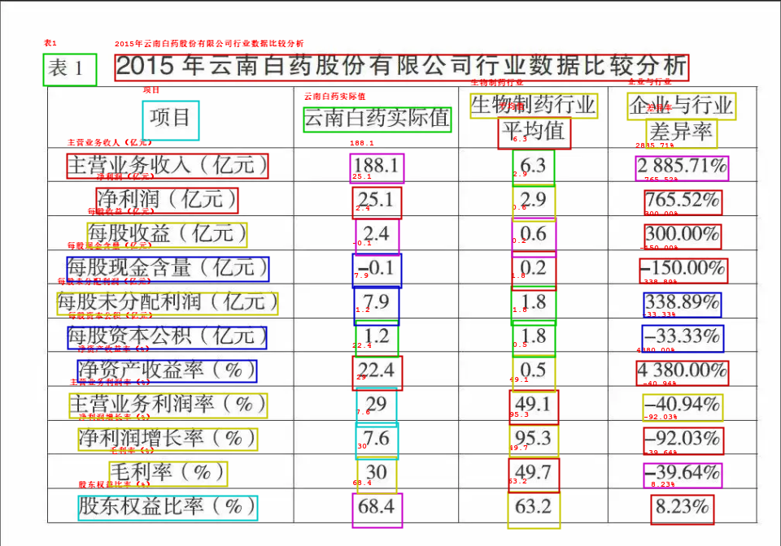
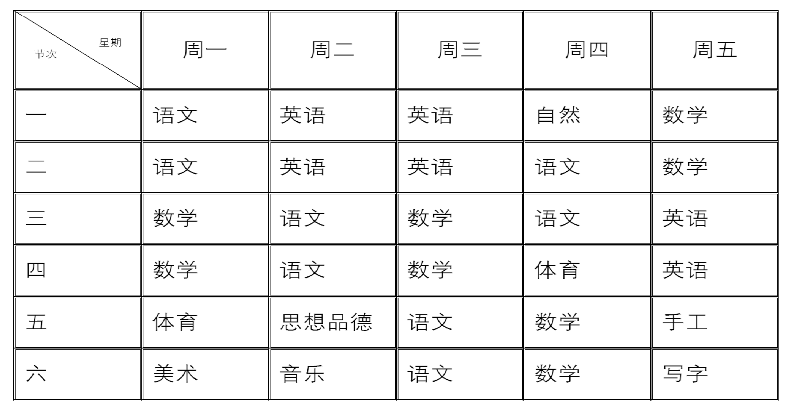
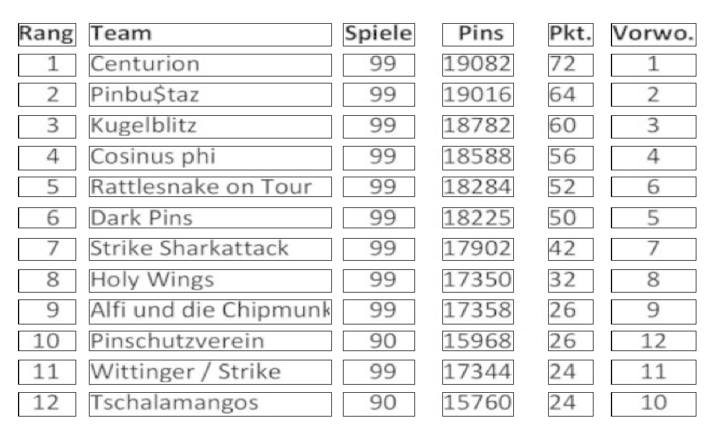
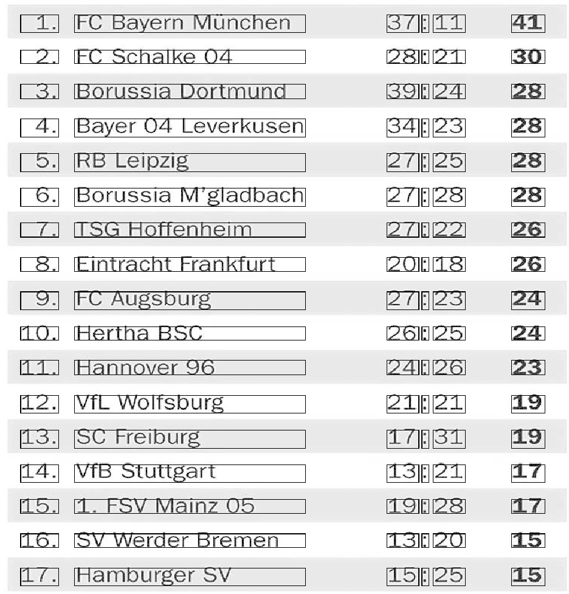

[](LICENSE)
[](requirements.txt)


English | [简体中文](README.md)

# AutoText

Intelligent text automatic processing tool

**AutoText**

The main functions of this project include text error correction, picture ocr and table structure recognition.

**Guide**

- [Text Error Correction](#Text Error Correction)
- [ocr](#ocr)
- [Table Structure Recognition](#Table Structure Recognition)
- [Todo](#Todo)
- [Contact](#Contact)
- [Citation](#Citation)
- [License](#License)
- [Contribute](#Contribute)
- [Reference](#reference)

## Text Error Correction

- The text error correction section is detailed here [jcorrector](https://github.com/jiangnanboy/jcorrector)
- This project mainly includes error correction based on ngram, error correction based on deep learning, error correction based on template Chinese grammar and error correction based on idiom、proper name, etc
- See the examples/correct section of this project for specific use

## ocr
- This part mainly uses the detection and recognition part in [paddleocr](https://github.com/PaddlePaddle/PaddleOCR) , and converts the model to ONNX format for calling, this project preprocesses the picture before recognition, so that in the CPU environment, the average image recognition time is about 10 seconds.
- See the examples/ocr/text/OcrDemo section of this project for specific use
- PS
    - [Download-Model(BaiduPan)](https://pan.baidu.com/s/1Nn-wO5NdL7FmSAZH6msGqA)
    - Password：b5vq
    - Place model in resources/text_recog or other position
- Usage
``` java
    // read image file
    String imagePath = "examples\\ocr\\img_test\\text_example.png";
    var imageFile = Paths.get(imagePath);
    var image = ImageFactory.getInstance().fromFile(imageFile);
    
    // init model
    String detectionModelFile = OcrDemo.class.getClassLoader().getResource(PropertiesReader.get("text_recog_det_model_path")).getPath().replaceFirst("/", "");
    String recognitionModelFile = OcrDemo.class.getClassLoader().getResource(PropertiesReader.get("text_recog_rec_model_path")).getPath().replaceFirst("/", "");
    Path detectionModelPath = Paths.get(detectionModelFile);
    Path recognitionModelPath = Paths.get(recognitionModelFile);
    OcrApp ocrApp = new OcrApp(detectionModelPath, recognitionModelPath);
    ocrApp.init();
    
    // predict result and consume time
    var timeInferStart = System.currentTimeMillis();
    Pair<List<TextListBox>, Image> imagePair = ocrApp.ocrImage(image, 960);
    System.out.println("consume time: " + (System.currentTimeMillis() - timeInferStart)/1000.0 + "s");
    for (var result : imagePair.getLeft()) {
            System.out.println(result);
    }
    // save ocr result image
    ocrApp.saveImageOcrResult(imagePair, "ocr_result.png", "examples\\ocr\\output");
    ocrApp.closeAllModel();
```
- Result，text and coordinate
```
    position: [800.0, 609.0, 877.0, 609.0, 877.0, 645.0, 800.0, 645.0], text: 8.23%
    position: [433.0, 607.0, 494.0, 607.0, 494.0, 649.0, 433.0, 649.0], text: 68.4
    position: [96.0, 610.0, 316.0, 611.0, 316.0, 641.0, 96.0, 640.0], text: 股东权益比率（%）
    position: [624.0, 605.0, 688.0, 605.0, 688.0, 650.0, 624.0, 650.0], text: 63.2
    position: [791.0, 570.0, 887.0, 570.0, 887.0, 600.0, 791.0, 600.0], text: -39.64%
    position: [625.0, 564.0, 687.0, 564.0, 687.0, 606.0, 625.0, 606.0], text: 49.7
    position: [134.0, 568.0, 279.0, 568.0, 279.0, 598.0, 134.0, 598.0], text: 毛利率（%）
    ......
```
- Display

<br/><br/> 
<p align="center">
  <a>
    
  </a>
</p>
<br/><br/>

## Table Structure Recognition
- Developed by opencv based on rules, the main table types identified are: bounded table, unbounded table and partially bounded table
- See the examples/ocr/text/TableDemo section of this project for specific use
- Usage
``` java
    public static void borderedRecog() {
        String imagePath = "examples\\ocr\\img_test\\bordered_example.png";
        Mat imageMat = imread(imagePath);
        System.out.println("imageMat : " + imageMat.size().height() + " " + imageMat.size().width() + " ");
        Pair< List<List<List<Integer>>>, Mat> pair = BorderedRecog.recognizeStructure(imageMat);
        System.out.println(pair.getLeft());
        ImageUtils.imshow("Image", pair.getRight());
    }

    public static void unBorderedRecog() {
        String imagePath = "examples\\ocr\\img_test\\unbordered_example.jpg";
        Mat imageMat = imread(imagePath);
        System.out.println("imageMat : " + imageMat.size().height() + " " + imageMat.size().width() + " ");
        Pair< List<List<List<Integer>>>, Mat> pair = UnBorderedRecog.recognizeStructure(imageMat);
        System.out.println(pair.getLeft());
        ImageUtils.imshow("Image", pair.getRight());
    }

    public static void partiallyBorderedRecog() {
        String imagePath = "examples\\ocr\\img_test\\partially_example.jpg";
        Mat imageMat = imread(imagePath);
        System.out.println("imageMat : " + imageMat.size().height() + " " + imageMat.size().width() + " ");
        Pair< List<List<List<Integer>>>, Mat> pair = PartiallyBorderedRecog.recognizeStructure(imageMat);
        System.out.println(pair.getLeft());
        ImageUtils.imshow("Image", pair.getRight());
    }
```
- Result，table cell coordinate
         
```
    [[[58, 48, 247, 182], [309, 48, 247, 182], [560, 48, 247, 182], [], [], [1061, 48, 247, 182], [1312, 48, 247, 182], 
    [811, 48, 246, 182], [], [], [], []], [[58, 234, 247, 118], [309, 234, 247, 118], [560, 234, 247, 118], [], [811, 234, 246, 118], 
    [], [1061, 234, 247, 118], [], [], [1312, 234, 247, 118], [], []], [[58, 356, 247, 118], [], [309, 356, 247, 118], 
    [560, 356, 247, 118], [], [811, 356, 246, 118], [], [], [1061, 356, 247, 118], [], [1312, 356, 247, 118], []], [[58, 478, 247, 118],
    [309, 478, 247, 118], [], [560, 478, 247, 118], [811, 478, 246, 118], [], [], [1312, 478, 247, 118], [], [1061, 478, 247, 118], [], []],
    [[58, 600, 247, 119], [309, 600, 247, 119], [], [811, 600, 246, 119], [560, 600, 247, 119], [1061, 600, 247, 119], [],
    [1312, 600, 247, 119], [], [], [], []], [[58, 723, 247, 118], [], [309, 723, 247, 118], [811, 723, 246, 118], [560, 723, 247, 118],
    [], [], [1061, 723, 247, 118], [], [1312, 723, 247, 118], [], []], [[58, 845, 247, 118], [309, 845, 247, 118], [], [], 
    [811, 845, 246, 118], [560, 845, 247, 118], [], [1312, 845, 247, 118], [], [1061, 845, 247, 118], [], []]]
```
- Display

<br/><br/> 
<p align="center">
  <a>
    
  </a>
</p>
<br/><br/>

<br/><br/> 
<p align="center">
  <a>
    
  </a>
</p>
<br/><br/>

<br/><br/> 
<p align="center">
  <a>
    
  </a>
</p>
<br/><br/>

## Todo

- [x] Add jcorrector for text error correction
- [x] Based on the paddleocr model, image ocr is implemented using java
- [x] Use opencv to identify table structures based on rules
      
...

## Contact

1、Tithub：https://github.com/jiangnanboy

2、Blog：https://www.cnblogs.com/little-horse/

3、Email:2229029156@qq.com

## Citation

If you used AutoText in your research, reference it in the following format:

```latex
@{jcorrector,
  author = {Shi Yan},
  title = {AutoText: Text automatic processing tool},
  year = {2023},
  url = {https://github.com/jiangnanboy/AutoText},
}
```

## License

**Apache License 2.0**

## Contribute

Interested friends are welcome to fork and submit PR.

## Reference
* https://github.com/jiangnanboy/jcorrector
* https://github.com/PaddlePaddle/PaddleOCR
* https://github.com/bytedeco/javacv
* https://github.com/deepjavalibrary/djl
* https://github.com/PaddlePaddle/Paddle
* https://github.com/microsoft/onnxruntime
* https://github.com/mymagicpower/AIAS
* https://github.com/jiangnanboy/java-springboot-paddleocr-v2
* https://github.com/jiangnanboy/java-springboot-paddleocr
* https://github.com/jiangnanboy/model2onnx
* https://github.com/jiangnanboy/macbert-java-onnx
* https://github.com/jiangnanboy/onnx-java
